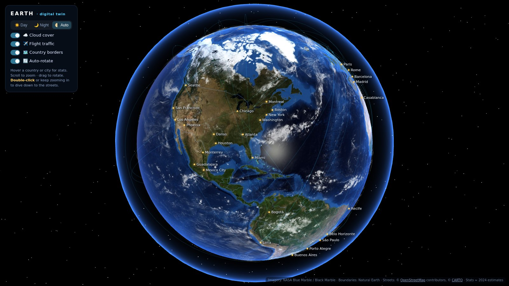
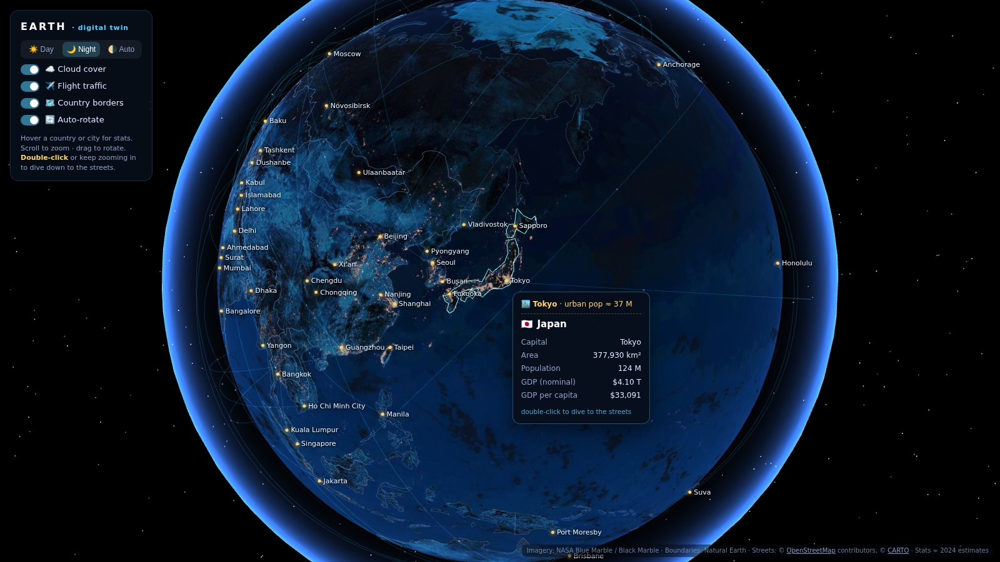
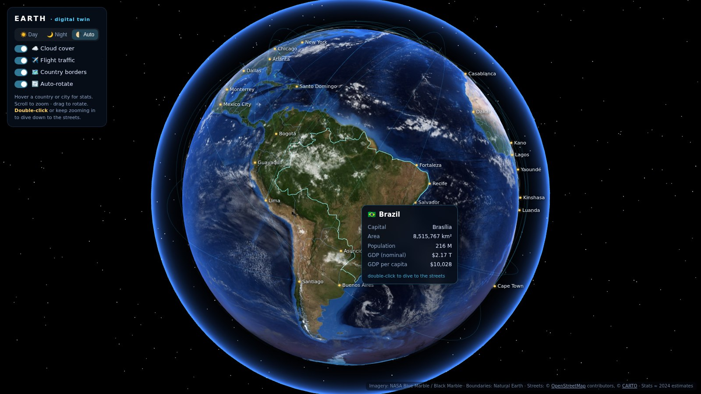

# 🌍 Earth — Digital Twin

A fully interactive **3D digital twin of Earth** that runs in any modern browser.
Zoom seamlessly from outer space down to individual city streets, hover any
country or city for live stats, and toggle clouds, flight traffic, and day/night.



## Features

- 🌐 **Photoreal globe** — NASA Blue Marble imagery with a real-time day/night
  terminator, warm twilight band, ocean sun-glint, and atmospheric glow
- 🌃 **Night mode** — NASA Black Marble city lights; the *Auto* mode computes the
  actual sun position from the current UTC time
- ☁️ **Toggleable cloud cover** — real cloud imagery drifting slowly over the surface
- ✈️ **Flight traffic** — animated great-circle arcs between ~70 world airport hubs
- 🗺️ **Hover a country or city** — the country's outline lights up and a popup
  shows capital, area, population, GDP, and GDP per capita (≈ 2024 estimates)
- 🏙️ **185 major cities** with population labels that declutter automatically
- 🔍 **Seamless zoom to street level** — double-click (or just keep zooming) and
  the globe hands off to an OpenStreetMap street map at the matching scale;
  night mode switches the streets to a dark basemap. Zoom back out or press
  <kbd>Esc</kbd> to return to orbit
- ⚡ **Loads fast** — ~5 MB total, no CDN dependencies, no build step, no API keys;
  everything except street-map tiles is served from this repo

| Night mode & city stats | Country hover |
| --- | --- |
|  |  |

## Run it

**Option 1 — GitHub Pages (easiest):** enable *Settings → Pages → Source:
GitHub Actions* once, and the included workflow deploys the site on every push.

**Option 2 — locally:** any static file server works (ES-module-free, no build):

```bash
git clone https://github.com/luvbuniz/earth.git
cd earth
python -m http.server 8000     # or: npm start
# open http://localhost:8000
```

> Opening `index.html` directly from the file system won't work — browsers
> block WebGL textures and `fetch()` on `file://` pages. Serve it (above) or
> use the Pages site.

## Controls

| Action | Result |
| --- | --- |
| Drag | Rotate the globe |
| Scroll | Zoom (orbit → ~290 km altitude) |
| Hover country / city | Outline highlight + stats popup |
| Click a city label | Fly to that city |
| Double-click anywhere (or keep zooming in) | Dive to street level |
| Scroll out / <kbd>Esc</kbd> / “Back to orbit” | Return to the globe |

## How it works

- **Rendering** — [three.js](https://threejs.org) with a custom GLSL shader that
  blends day/night textures across the sun terminator, plus Lambert-lit clouds
  and a back-side fresnel atmosphere shell
- **Country hover** — Natural Earth 110m polygons; a ray-cast from the cursor is
  converted to lat/lng and point-in-polygon tested (with bounding-box pre-checks);
  outlines render as one merged `LineSegments` buffer, and the highlight reuses
  the same GPU buffer via `drawRange` — zero per-hover allocation
- **Street handoff** — the globe's meters-per-pixel at the current camera altitude
  is matched to the equivalent [Leaflet](https://leafletjs.com) zoom level, so the
  transition keeps scale (and reverses the same way)
- **Data** — `assets/data/world.geo.json` is generated by `npm run build:data`,
  which merges [world-atlas](https://github.com/topojson/world-atlas) geometry,
  [world-countries](https://github.com/mledoze/countries) metadata, and the
  population/GDP estimates in `tools/country-stats.mjs`

```
index.html            page shell
css/style.css         UI styling
js/app.js             the whole application (globe, hover, flights, map handoff)
js/data.js            city + airport datasets
assets/textures/      NASA-derived Earth imagery (day, night, clouds, water mask)
assets/data/          generated country GeoJSON with stats baked in
tools/                dataset build scripts (npm run build:data)
vendor/               three.js r147, OrbitControls, Leaflet 1.9.4 (vendored)
```

## Data sources & credits

- Imagery: [NASA Blue Marble / Black Marble](https://visibleearth.nasa.gov/)
  (via the [three-globe](https://github.com/vasturiano/three-globe) example assets)
- Boundaries: [Natural Earth](https://www.naturalearthdata.com/) (public domain)
- Street tiles: © [OpenStreetMap](https://www.openstreetmap.org/copyright)
  contributors; dark basemap © [CARTO](https://carto.com/attributions)
- Country metadata: [mledoze/countries](https://github.com/mledoze/countries) (ODbL)
- Population / GDP: hand-rounded ≈2024 UN / IMF estimates — for visualization,
  not analysis

Code is MIT-licensed (see `LICENSE`).
